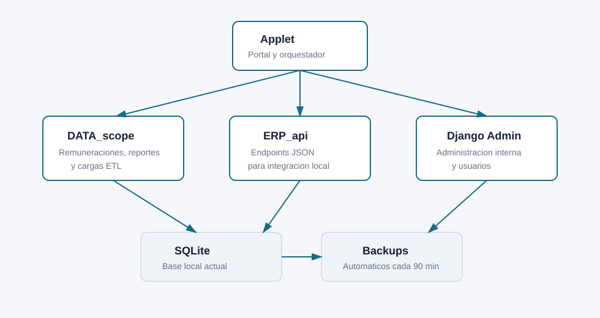

# Celestial ERP

ERP web modular para remuneraciones, asistencia, contabilidad, inventario, compras y ventas. Incluye un pipeline ETL para transformar liquidaciones historicas, control de acceso por roles, auditoria, API interna y respaldos PostgreSQL verificados.

> Version actual: **1.1.1a** · Backend Django con PostgreSQL · Operacion local/LAN controlada



## Estado del proyecto

Celestial ERP comenzo como un proceso ETL para liquidaciones historicas y evoluciono a una aplicacion Django multiusuario. La migracion desde SQLite a PostgreSQL ya fue completada y validada con `297.084` objetos historicos. SQLite se conserva solamente como respaldo de reversa y fuente historica.

Actualmente estan operativos:

- portal web, login, navegacion por permisos y Django Admin personalizado;
- remuneraciones, trabajadores, periodos, items, movimientos y liquidaciones;
- carga ETL web y por consola, con seguimiento de corridas y validaciones;
- asistencia diaria, reportes mensuales e integracion con remuneraciones;
- contabilidad base, inventario, compras y ventas;
- reportes, exportaciones CSV e impresion/PDF desde navegador;
- auditoria estructurada por usuario, rol, objeto y cambios;
- API JSON interna protegida;
- backups PostgreSQL manuales mediante `pg_dump`, verificados con `pg_restore`;
- configuracion separada para desarrollo y produccion.

El siguiente ciclo se enfoca en restauracion PostgreSQL probada, automatizacion externa de backups, endurecimiento de credenciales y construccion progresiva de un frontend Next.js/TypeScript.

## Modulos

| Modulo | Aplicacion Django | Alcance actual |
| --- | --- | --- |
| Portal y control | `Applet` | Inicio, modulos, seguridad, auditoria, backups y estado del sistema |
| Remuneraciones | `DATA_scope` | Trabajadores, periodos, items, movimientos, liquidaciones, reportes y ETL |
| Asistencia | `Attendance` | Registros diarios, historico, reporte mensual y sincronizacion con remuneraciones |
| Contabilidad | `Accounting` | Plan de cuentas, centros de costo, mapeos, asientos y reportes iniciales |
| Inventario | `Inventory` | Productos, bodegas, stock, movimientos y valorizacion |
| Compras y ventas | `Commerce` | Proveedores, clientes, ordenes de compra y venta |
| API interna | `ERP_api` | Salud, estado, modulos y consultas de remuneraciones protegidas |

## Arquitectura

```text
Navegador
   |
   v
Django (templates + API + permisos + auditoria + ETL)
   |
   v
PostgreSQL
```

La evolucion prevista mantiene Django como autoridad de negocio y acceso a datos:

```text
Navegador -> Nginx/HTTPS -> Next.js
                        -> API Django -> PostgreSQL
```

El navegador y el futuro frontend nunca deben conectarse directamente a PostgreSQL.

## Tecnologias

- Python 3.12+
- Django 6.0
- PostgreSQL y `psycopg` 3
- pandas y openpyxl para ETL
- Bootstrap 5.3.3 servido localmente
- HTML, CSS y JavaScript sin dependencia de CDN
- `pg_dump` y `pg_restore` para respaldos PostgreSQL

Las versiones declaradas se encuentran en [`requirements.txt`](requirements.txt).

## Requisitos

- Python compatible con Django 6.0.
- PostgreSQL en ejecucion.
- Base y usuario PostgreSQL creados.
- Herramientas cliente `pg_dump` y `pg_restore` para respaldos.
- Acceso local o LAN controlado; no se recomienda exponer `runserver` a internet.

## Instalacion rapida

### 1. Clonar y crear el entorno

```bash
git clone https://github.com/roiwow7-maker/Celestial-ERP.git
cd Celestial-ERP
python3 -m venv venv
source venv/bin/activate
pip install -r requirements.txt
```

En PowerShell:

```powershell
python -m venv venv
.\venv\Scripts\Activate.ps1
pip install -r requirements.txt
```

### 2. Crear PostgreSQL

Ejemplo desde `psql` usando nombres propios para el ambiente:

```sql
CREATE USER celestial_app WITH PASSWORD 'CAMBIAR_ESTA_CLAVE';
CREATE DATABASE celestial_erp OWNER celestial_app;
```

No escribas credenciales reales en archivos versionados.

### 3. Configurar variables

Variables principales:

```text
POSTGRES_DB=celestial_erp
POSTGRES_USER=celestial_app
POSTGRES_PASSWORD=una-clave-segura
POSTGRES_HOST=127.0.0.1
POSTGRES_PORT=5432
DJANGO_SECRET_KEY=una-clave-larga-y-unica
DJANGO_ALLOWED_HOSTS=127.0.0.1,localhost
ERP_SETTINGS_ENV=dev
```

Consulta [`.env.example`](.env.example) para ver todas las opciones. Django toma estas variables del entorno; el archivo `.env` no se publica ni se carga automaticamente sin una herramienta externa.

Para desarrollo local tambien se admite `Celestial_ERP/.postgres_password`, que esta ignorado por Git. En produccion deben utilizarse secretos del sistema o variables protegidas.

### 4. Preparar Django

```bash
cd Celestial_ERP
python manage.py migrate
python manage.py createsuperuser
python manage.py check
python manage.py runserver 127.0.0.1:8000
```

Abrir:

- Portal: <http://127.0.0.1:8000/>
- Django Admin: <http://127.0.0.1:8000/admin/>
- API interna: <http://127.0.0.1:8000/api/>

En Windows tambien puede utilizarse [`start_erp_web.ps1`](start_erp_web.ps1).

## Roles y seguridad

El acceso requiere login. Los roles funcionales son:

| Rol | Alcance general |
| --- | --- |
| Administrador | Configuracion, seguridad, auditoria, backups y operacion completa |
| RRHH | Trabajadores, remuneraciones, cargas y asistencia |
| Contabilidad | Lectura de remuneraciones y operacion contable/comercial autorizada |
| Solo lectura | Consulta de modulos permitidos sin operaciones sensibles |

Inicializacion de grupos y permisos:

```bash
python manage.py setup_access_control
```

Para ambientes compartidos:

- usar usuarios nominales y rotar credenciales temporales;
- definir `ERP_SETTINGS_ENV=prod` y `DJANGO_DEBUG=false`;
- configurar `DJANGO_SECRET_KEY`, hosts, cookies seguras y HTTPS;
- no publicar PostgreSQL directamente en internet;
- revisar auditoria y logs periodicamente.

Consulta [Administracion y multiusuario](docs/05_ADMIN_MULTIUSUARIO.md) y [Seguridad, roles y permisos](docs/assets/08_seguridad_roles_permisos.md).

## Pipeline ETL

El pipeline acepta fuentes XLS, XLSX y CSV, normaliza liquidaciones historicas, clasifica items, genera salidas de revision e importa datos a Django.

Flujo general:

```text
Fuente historica
  -> transformacion y normalizacion
  -> clasificacion de items
  -> CSV/Excel de revision
  -> validaciones
  -> importacion transaccional a Django/PostgreSQL
  -> reportes y auditoria
```

Ejecucion principal:

```bash
python run_etl.py --help
```

Importacion directa desde Django:

```bash
python Celestial_ERP/manage.py import_payroll_data --help
```

Los archivos de entrada y salida contienen informacion privada y estan excluidos globalmente del repositorio.

Documentacion: [Pipeline ETL](docs/03_ETL_PIPELINE.md) y [Reglas de remuneraciones](REGLAS_NEGOCIO_REMUNERACIONES.md).

## Backups PostgreSQL

Crear un respaldo apropiado para la base activa:

```bash
cd Celestial_ERP
python manage.py backup_database
```

Con PostgreSQL, el comando:

1. ejecuta `pg_dump` en formato custom comprimido;
2. omite propietarios y privilegios especificos del servidor;
3. verifica el archivo mediante `pg_restore --list`;
4. aplica retencion de 30 dias conservando al menos siete copias;
5. registra la operacion cuando se ejecuta desde la pantalla administrativa.

Los respaldos se guardan en `backups/`, carpeta excluida de Git. Deben copiarse cifrados a una ubicacion independiente.

Estado pendiente importante: probar una restauracion PostgreSQL completa en una base aislada y programar `backup_database` mediante el planificador del sistema. No debe ejecutarse un backup pesado dentro de cada peticion web.

## Comandos utiles

Desde `Celestial_ERP/`:

```bash
python manage.py check
python manage.py showmigrations
python manage.py migrate
python manage.py setup_access_control
python manage.py validate_business_rules
python manage.py sync_attendance_payroll
python manage.py cleanup_uploads --days 30
python manage.py backup_database
```

Ayuda detallada:

```bash
python manage.py help <comando>
```

## Pruebas

Comprobacion base:

```bash
cd Celestial_ERP
python manage.py check
python manage.py makemigrations --check --dry-run
```

Suite por aplicaciones:

```bash
python manage.py test Applet DATA_scope ERP_api Accounting Inventory Commerce Attendance
```

La cuenta PostgreSQL utilizada para ejecutar la suite debe poder crear la base temporal de pruebas. Las pruebas relacionadas exclusivamente con respaldos SQLite se mantienen como cobertura historica y deben continuar aisladas de la base productiva.

## Estructura del repositorio

```text
Celestial-ERP/
├── Celestial_ERP/             # Proyecto Django y aplicaciones
│   ├── Accounting/
│   ├── Applet/
│   ├── Attendance/
│   ├── Celestial_ERP/         # Settings, URLs, ASGI y WSGI
│   ├── Commerce/
│   ├── DATA_scope/
│   ├── ERP_api/
│   ├── Inventory/
│   └── manage.py
├── docs/                      # Manuales, arquitectura y operacion
├── tools/                     # Herramientas auxiliares ETL/Excel
├── run_etl.py                 # Orquestador ETL
├── requirements.txt
├── ROADMAP.md
└── version_log.md
```

No forman parte del repositorio: bases de datos, dumps, backups, CSV, Excel, uploads, reportes operativos, logs, entornos virtuales y secretos.

## Documentacion

Lectura recomendada:

1. [Documentacion general](docs/00_DOCUMENTACION_GENERAL.md)
2. [Manual completo](docs/MANUAL_COMPLETO_CELESTIAL_ERP.md)
3. [Indice maestro](docs/INDICE_DOCUMENTACION.md)
4. [Roadmap](ROADMAP.md)
5. [Registro de versiones](version_log.md)

Por tema:

- [Portal y orquestador](docs/01_APPLET_PORTAL.md)
- [Remuneraciones](docs/02_DATA_SCOPE_REMUNERACIONES.md)
- [API interna](docs/04_API.md)
- [Operacion y backups](docs/06_OPERACION_LOCAL_BACKUPS.md)
- [Contabilidad](docs/11_CONTABILIDAD.md)
- [Inventario](docs/12_INVENTARIO.md)
- [Compras y ventas](docs/13_COMPRAS_VENTAS.md)
- [Asistencia](docs/14_ASISTENCIA.md)
- [Deploy LAN](docs/18_DEPLOY_LAN.md)
- [PostgreSQL, Nginx y Next.js](docs/20_POSTGRESQL_NGINX_NEXTJS.md)
- [Plan del frontend real](docs/21_PLAN_FRONTEND_REAL.md)
- [Publicacion segura en GitHub](GITHUB_PUBLICACION.md)

Algunos documentos describen etapas historicas sobre SQLite. Para decisiones actuales prevalecen este README, [`ROADMAP.md`](ROADMAP.md), [`version_log.md`](version_log.md) y los documentos `20`/`21`.

## Privacidad del repositorio

Este repositorio no contiene los datos utilizados por el ERP. `.gitignore` y el hook `.githooks/pre-commit` bloquean:

- SQLite, dumps PostgreSQL y archivos SQL;
- CSV, XLS, XLSX, XLSM y ODS;
- backups, uploads y reportes;
- `.env`, contraseñas locales, secretos y claves;
- logs, archivos temporales y entornos virtuales.

Antes de cada publicacion se debe revisar:

```bash
git status --short
git diff --cached --name-only
```

Si un secreto o dato privado entra al historial, eliminarlo en un commit posterior no es suficiente: debe rotarse la credencial y limpiarse el historial antes de publicar.

## Roadmap

Prioridades inmediatas:

1. restauracion PostgreSQL completa y verificable;
2. automatizacion y monitoreo externo de backups;
3. credenciales obligatorias mediante variables/secretos protegidos;
4. suite automatizada completa sobre PostgreSQL;
5. usuarios nominales y validacion LAN;
6. primer flujo vertical del frontend Next.js/TypeScript.

El detalle se mantiene en [`ROADMAP.md`](ROADMAP.md) y [Plan del frontend real](docs/21_PLAN_FRONTEND_REAL.md).

## Versionado y mantenimiento

La fuente unica de version es:

```text
Celestial_ERP/Applet/version.py
```

Cada mejora debe:

1. actualizar `ERP_VERSION`;
2. registrar el cambio en `version_log.md`;
3. actualizar el roadmap cuando cierre o agregue un hito;
4. ejecutar las comprobaciones relacionadas;
5. verificar que no se incluyan datos privados.

## Licencia

El repositorio todavia no incluye una licencia de distribucion. Hasta definirla, el codigo no debe asumirse como software de uso, modificacion o redistribucion libre.
