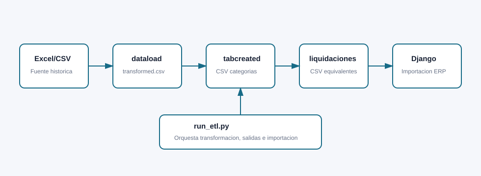

# ETL Pipeline

Fecha de referencia: 2026-07-20

## Estado del flujo

Estado actual: **flujo ETL base operativo dentro de Celestial ERP v1.0.8**.

El flujo ETL ya permite transformar historicos de remuneraciones, separar categorias, generar archivos equivalentes a liquidaciones, crear Excel final e importar datos al ERP Django.

El flujo puede ejecutarse por consola con `run_etl.py` o desde la pantalla web `/cargas/`.

## Proposito

El ETL transforma historicos de remuneraciones desde Excel hacia una estructura normalizada, genera salidas compatibles con plantillas y carga datos en Django.

## Diagrama



## Scripts principales

| Archivo | Funcion |
| --- | --- |
| `dataload.py` | Convierte Excel historico a CSV largo `transformed.csv` |
| `tabcreated.py` | Separa `transformed.csv` en CSV por categoria |
| `build_liquidaciones_csvs.py` | Genera CSV equivalentes a hojas de liquidaciones |
| `transfer_liquidaciones_to_excel.py` | Carga CSV generados a una plantilla Excel |
| `run_etl.py` | Orquestador general del flujo |
| `import_payroll_data.py` | Comando Django para importar a base |

## Flujo completo

1. Leer archivo fuente.
2. Transformar historico a formato largo.
3. Clasificar `codigo_item` por categoria.
4. Generar `transformed.csv`.
5. Separar CSV por categoria.
6. Generar CSV equivalentes a hojas de liquidaciones.
7. Generar Excel final si corresponde.
8. Importar trabajadores, periodos, items, movimientos y liquidaciones al ERP.
9. Registrar auditoria de importacion en `ImportRun`.

## Entradas

- `ITEMS_ACUMULADOS_Historico Payroll.xlsx`
- CSV transformado compatible con `transformed.csv`

Formatos aceptados por el orquestador:

- `.xlsx`
- `.xls`
- `.csv`

## Salidas

- `transformed.csv`
- `csv_por_categoria/`
- `csv_equivalentes_liquidaciones/`
- `Liquidaciones_Historicas_Cargadas.xlsx`
- Datos importados en SQLite/Django

Salidas Django:

- `Employee`
- `PayrollPeriod`
- `PayrollItem`
- `PayrollEntry`
- `PayrollSummary`
- `ImportRun`

## Categorias de items

- haberes_normales_imponibles
- haberes_exentos_no_imponibles
- asignaciones_familiares
- contribucion_empleador
- descuentos_legales_previsionales
- otros_descuentos
- provisiones
- totales
- sin_clasificar

## Ejecucion por consola

```powershell
python run_etl.py
python run_etl.py --input archivo.xlsx
python run_etl.py --input archivo.csv --source-format transformed_csv
```

Opciones utiles:

```powershell
python run_etl.py --skip-excel
python run_etl.py --skip-import
python run_etl.py --clear
python run_etl.py --rut-empresa 76123456-7
```

## Ejecucion desde web

Ruta:

```text
/cargas/
```

Permite:

- Subir archivo.
- Detectar formato.
- Generar Excel final.
- Importar al ERP.
- Limpiar datos previos si corresponde.

Cada corrida web queda guardada en:

```text
uploads/<timestamp>/
```

## Validaciones

Validaciones existentes:

- `validacion_excel_vs_csv.csv`
- `csv_equivalentes_liquidaciones/validacion_resultados.csv`
- `reports/business_rules_validation.csv`

Comando:

```powershell
python manage.py validate_business_rules
```

## Checklist funcional v0.3

- [x] Transformacion Excel historico a CSV largo.
- [x] Soporte de CSV transformado como entrada.
- [x] Separacion por categorias.
- [x] Generacion de CSV equivalentes a liquidaciones.
- [x] Generacion de Excel final.
- [x] Importacion a Django.
- [x] Auditoria de importaciones con `ImportRun`.
- [x] Carga web desde `/cargas/`.
- [x] Validacion de columnas requeridas.
- [x] Validacion de reglas de negocio principales.

## Pendientes futuros

El ETL queda estable como base historica. Los siguientes pasos recomendados son:

- Reporte de errores por fila y columna.
- Mejor validacion previa antes de importar.
- Resumen de calidad por corrida.
- Control de duplicados mas visible.
- Cola real de trabajos solo si los archivos o usuarios concurrentes crecen.
- Carga individual controlada desde pantallas de remuneraciones.
